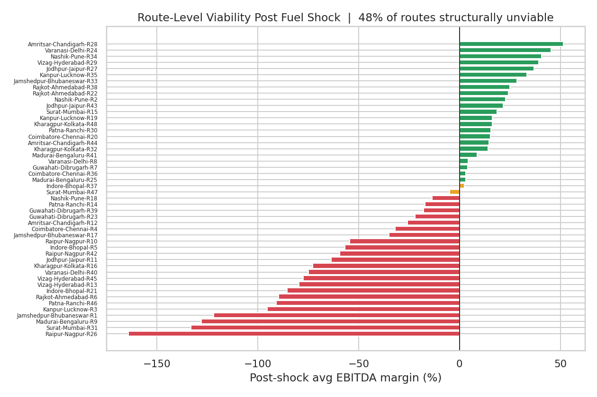
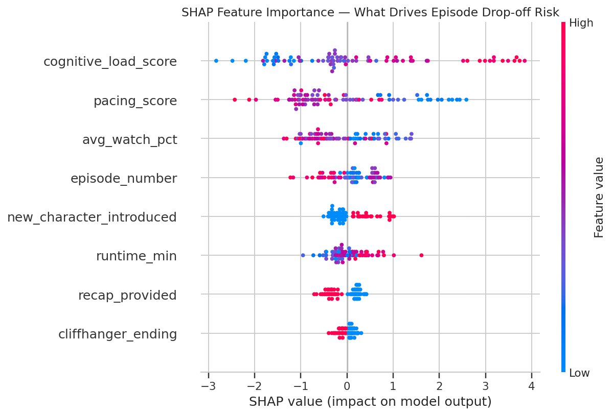
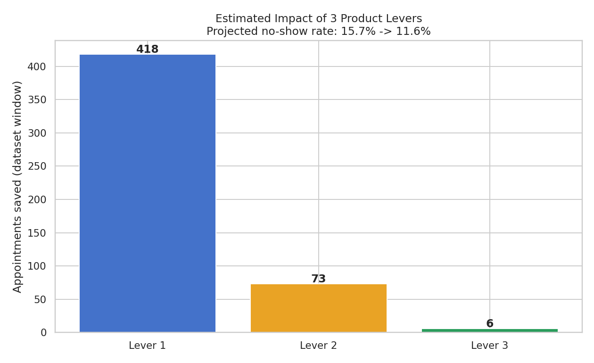

# Consulting & Analytics Capstone — 3 Case Studies, End-to-End

**Winter Consulting Capstone 2025, Consulting & Analytics Club, IIT Guwahati** — solved
as a full data + product pipeline: synthetic data generation → EDA → ML modeling with
explainability → quantified business recommendation → interactive dashboard.

> 🎯 **Why this repo exists:** the original case brief is a set of PDF slides meant to
> be answered with a static PowerPoint deck. This repo answers the same three business
> questions with real, runnable code and reproducible numbers instead — the kind of
> artifact that's actually worth showing in a technical/PM interview.

---

## The 3 cases

| | Case 1 — Airline | Case 2 — OTT Platform | Case 3 — Telemedicine |
|---|---|---|---|
| **Role** | Strategy consultant | Data consultant | Product Manager |
| **Problem** | Fuel-price shock threatens route network profitability | Viewers drop off mid-Season-1 | Patients miss scheduled video consultations |
| **Deliverable** | Pick 1 of 3 strategic options (18–24mo) | Diagnose drop-off drivers + segment episodes | Product fix within tight constraints (no redesign, no new hardware) |
| **This repo adds** | Route-level P&L model, fuel-shock loss attribution, 3-option scenario simulation | Drop-off classifier + SHAP, K-Means episode segmentation | No-show risk model + SHAP, 3-lever impact simulation |

**On the data:** the case brief supplied a real dataset only for Case 2 (via a link not
reachable outside the original competition), and none for Cases 1 or 3 (they're strategy/
product briefs). All three datasets here are **synthetically generated** with documented,
realistic generative logic — see [`data/README.md`](data/README.md) and each script in
`src/data_generation/` for exactly how and why. This was a deliberate choice: it means the
full pipeline (not just the slide deck) can be run, tested, and verified by anyone who
clones this repo.

---

## Quickstart

```bash
git clone <your-repo-url>
cd consulting-portfolio
pip install -r requirements.txt

# Generate all 3 datasets
python src/data_generation/generate_airline_data.py
python src/data_generation/generate_ott_data.py
python src/data_generation/generate_telemedicine_data.py

# Run each case's full pipeline
python src/case1_airline/analysis.py
python src/case2_ott/eda.py && python src/case2_ott/churn_model.py && python src/case2_ott/segmentation.py
python src/case3_telemedicine/eda.py && python src/case3_telemedicine/noshow_model.py && python src/case3_telemedicine/intervention_simulation.py

# Explore interactively
streamlit run dashboard/app.py

# Or read the narrated notebooks (already executed, outputs included)
jupyter notebook notebooks/
```

Run the test suite: `pytest tests/ -v`

---

## Repo structure

```
consulting-portfolio/
├── data/
│   ├── raw/                    # generated CSVs (airline, OTT, telemedicine)
│   ├── processed/              # model outputs, verdicts, segment profiles
│   └── README.md               # data dictionary
├── src/
│   ├── data_generation/        # 3 synthetic-data generators
│   ├── case1_airline/          # route economics + scenario modeling
│   ├── case2_ott/              # EDA, drop-off classifier + SHAP, segmentation
│   └── case3_telemedicine/     # EDA, no-show classifier + SHAP, intervention simulation
├── notebooks/                  # narrated, pre-executed walkthroughs (1 per case)
├── dashboard/app.py            # Streamlit app tying all 3 cases together
├── reports/figures/            # 20 generated charts
├── tests/                      # pytest sanity tests on the data pipeline
└── .github/workflows/ci.yml    # CI: runs tests + full pipeline on every push
```

---

## Results summary

### Case 1 — Airline fuel shock
- Post-shock, **~48% of routes become structurally unviable** (EBITDA margin < -5%),
  consistent with the case's own early estimate of 30–40% at-risk.
- Decomposed the EBITDA decline into fuel-driven vs structural components per route.
- **Recommendation:** Option A (network optimization/pricing) as primary, Option B (UDAN)
  applied *selectively* only to the unviable subset, Option C deferred as a parallel
  12–24mo workstream — not the primary bet for an 18–24mo decision window.



### Case 2 — OTT viewer retention
- Trained a classifier (AUC 0.77) to predict high-drop-off-risk episodes; **SHAP
  confirms `cognitive_load_score` and `pacing_score` are the two dominant drivers** —
  recovering the exact signal the synthetic ground-truth was built on.
- K-Means (k=4, chosen via silhouette score) segments episodes into content clusters
  with meaningfully different drop-off rates (15%–32%).
- **Recommendation:** targeted pacing/complexity review for episodes 4–5 specifically
  (where the mid-season slump and the SHAP drivers coincide), not a blanket mandate.



### Case 3 — Telemedicine no-shows
- Baseline no-show rate: **15.7%**. Built a risk classifier (AUC 0.64, deliberately
  evaluated by top-20%-risk threshold rather than default 0.5, since no-shows are only
  ~16% of the data — a naive "always predict show" model would look 84% accurate while
  being useless).
- Simulated 3 concrete, low-lift product levers (default reminder upgrade, connectivity
  nudge, re-confirmation nudge) — **projected no-show rate: 15.7% → 11.6%**, with the
  reminder-default change alone accounting for most of the gain.
- All three levers respect the case's stated constraint: no redesign, no new hardware,
  only flow/default/in-app changes.



---

## Tech stack

`Python` · `pandas` / `numpy` · `scikit-learn` (GradientBoosting, KMeans, PCA) ·
`SHAP` (model explainability) · `matplotlib` / `seaborn` (static charts) ·
`Plotly` (interactive charts) · `Streamlit` (dashboard) · `pytest` (data pipeline tests) ·
`GitHub Actions` (CI)

---

## How I'd explain this in an interview (60-second version)

*"I took a 3-case business consulting competition brief and rebuilt it as a real
analytics pipeline instead of a slide deck. Two of the three cases had no dataset
attached, so I wrote generators that produce realistic synthetic data grounded in
actual unit economics — for the airline case that's `revenue = seats × load_factor ×
fare`, `fuel_cost = flights × block_hours × burn_rate × ATF_price`, calibrated against
the numbers the case brief itself states (70–75% load factors, thin-but-positive
pre-shock margins). For the two cases with real business decisions — OTT retention and
telemedicine no-shows — I trained gradient-boosted classifiers, used SHAP to explain
*why* the model predicts what it predicts, and translated that into segment-level and
lever-level business recommendations with quantified impact, not just 'here's a
model'. I also caught and fixed two real bugs during development — a revenue/cost unit
mismatch in the airline generator, and a pandas parsing bug where the literal string
'None' gets silently read back as NaN — both of which I turned into regression tests
so they can't silently reappear."*

---

## Original case brief

The source problem statements this project answers are in
[`Winter_Consulting_Capstone_Project_Problem_Statements.pdf`](./Winter_Consulting_Capstone_Project_Problem_Statements.pdf)
(Consulting & Analytics Club, IIT Guwahati — Winter Consulting 2025).
